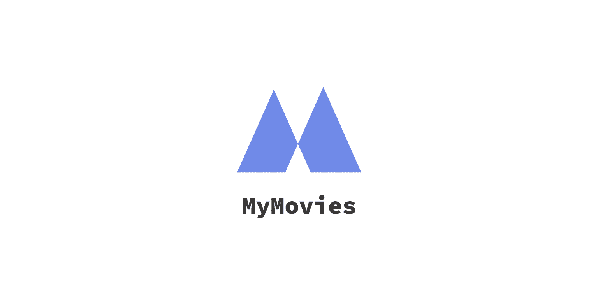

</img>

# Introduction

This is MyMovies. A movie-journal app which allows users to make lists keeping track of their favourite films while sharing them with other users.

---

# Objectives

To build a full stack tracking-type web application with user logins, authentication and the ability to have unique profiles. I wanted this app to be a place where fellow movie buffs could track their movies and share their favourite with others.

---

# Who is this for? 

Film enthusiasts looking for a convenient way to keep track of their movie habits

---

# Optimizations 

  These are some of the optimizations I am in the midst of implementing into my project given the time.
  
- Add Google Auth (on top of Passport which is currently functional)
- General optimizations for progressive rendering
- Add more responsiveness for mobile devices/tablets/smaller screens

---

# Tech used 

JavaScript, MongoDB, Express, Node, CSS, EJS, Passport, Bootstrap5

---

# Packages/Dependencies used 

bcrypt, connect-mongo, dotenv, ejs, express, express-flash, express-session, mongodb, mongoose, morgan, nodemon, passport, passport-local, validator, bootstrap

---

# Install

`npm install`

---

# Things to add

- Create a `.env` file in config folder and add the following as `key = value`
  - PORT = 2121 (can be any port example: 3000)
  - DB_STRING = `your database URI`
  - CLOUD_NAME = `your cloudinary cloud name`
  - API_KEY = `your cloudinary api key`
  - API_SECRET = `your cloudinary api secret`

---

# Run

`npm start`
